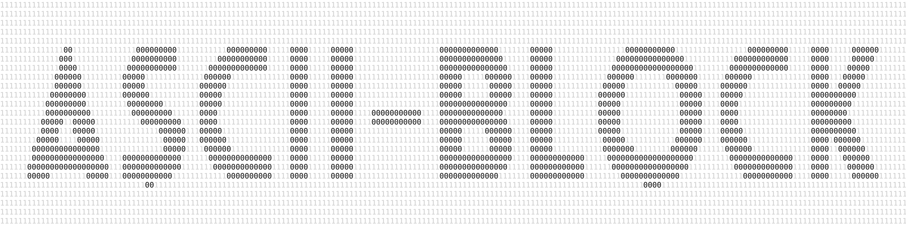

# [ASCII-Block](https://github.com/jcubic/ascii-block)



A Python script that renders text as binary art using a real font. The text is
drawn onto a Pillow canvas, each pixel is sampled, and the result is output as a
character grid where one character represents the letters and another fills the
background.

## Requirements

- Python 3.10+
- [Pillow](https://pypi.org/project/Pillow/)

```bash
pip install Pillow
```

A TrueType or OpenType font must be available on the system. The script
auto-detects common fonts (DejaVu Sans Bold, FreeSans Bold, Helvetica, Arial)
or you can specify one explicitly with `--font`.

## Usage

```
python generate.py [options] [TEXT]
```

The positional `TEXT` argument defaults to `CODE`.

## Options

| Short | Long | Default | Description |
|-------|------|---------|-------------|
| `-w` | `--width` | terminal width | Output width in characters. Detected via ANSI DSR escape, falling back to `shutil.get_terminal_size`, then 80. |
| `-h` | `--height` | width / 4 | Output height in characters (minimum 10). |
| `-f` | `--foreground` | `0` | Character(s) used for the text pixels. Supports ANSI escape codes. |
| `-b` | `--background` | `1` | Character(s) used for the background pixels. Supports ANSI escape codes. |
| `-p` | `--padding` | `0` | Padding in characters around the text on all four sides. |
| `-x` | `--font` | auto-detect | Path to a TrueType/OpenType font file. |
| `-o` | `--output` | stdout | Write output to a file instead of printing. |
| | `--format` | `text` | Output format: `text` or `svg`. |
| | `--fcolor` | `#000000` | Foreground character colour in SVG (hex code). |
| | `--bcolor` | `#cccccc` | Background character colour in SVG (hex code). |
| | `--svg-background` | `#ffffff` | SVG rectangle background colour (hex code). |
| | `--help` | | Show help message and exit. |

> **Note:** `-h` is used for `--height`, so help is only available via `--help`.

## ANSI Escape Codes

The `--foreground` and `--background` values support escape notations so you can
produce coloured terminal output. The following forms are recognised and
converted to the real escape character:

- `\033` or `\e` — ESC
- `\x1b` — hex byte
- `\u001b` — Unicode escape

Wrap the value in single quotes to prevent your shell from interpreting the
backslashes.

## Examples

### Basic usage

```bash
python generate.py
```

```
11111111111001111111111111111001111111111111111111111111111111111111111111111111
11111110000000000111111110000000000111111110000000000001111111110000000000000111
11111000000000000011111100000000000001111110000000000000011111110000000000000111
11110000000000000011111000000000000000111110000000000000001111110000000000000111
11100000001111100011110000001111000000111110000011110000000111110000011111111111
11100000111111111111100000011111100000011110000011111100000011110000011111111111
11000000111111111111100000111111110000011110000011111110000011110000011111111111
11000001111111111111100000111111110000011110000011111110000001110000011111111111
11000001111111111111100000111111111000001110000011111111000001110000000000000111
11000001111111111111100000111111111000001110000011111111000001110000000000000111
11000001111111111111100000111111111000001110000011111111000001110000000000000111
11000001111111111111100000111111111000001110000011111111000001110000001111111111
11000001111111111111100000111111110000011110000011111110000001110000011111111111
11000000111111111111100000111111110000011110000011111110000011110000011111111111
11100000111111111111100000011111100000011110000011111100000011110000011111111111
11100000001111100011110000001111000000111110000011100000000111110000001111111111
11110000000000000011111000000000000000111110000000000000001111110000000000000011
11111000000000000011111100000000000001111110000000000000011111110000000000000011
11111110000000000111111110000000000111111110000000000001111111110000000000000011
11111111111001111111111111111001111111111111111111111111111111111111111111111111

```

### Custom characters

```bash
python generate.py -f '#' -b '.' HELLO
```

```
......................................................................#.........
..#####......####....###########....####..........####............########......
..#####......####....###########....####..........####...........###########....
..#####......####....###########....####..........####..........#############...
..#####......####....####...........####..........####.........#####....#####...
..#####......####....####...........####..........####.........####......#####..
..#####......####....####...........####..........####........#####.......####..
..#####......####....####...........####..........####........#####.......####..
..###############....##########.....####..........####........####........####..
..###############....##########.....####..........####........####........####..
..###############....##########.....####..........####........####........####..
..#####.....#####....####...........####..........####........####........####..
..#####......####....####...........####..........####........#####.......####..
..#####......####....####...........####..........####........#####.......####..
..#####......####....####...........####..........####.........####......#####..
..#####......####....####...........####..........####.........#####....#####...
..#####......####....###########....###########...###########...#############...
..#####......####....###########....###########...###########....###########....
..#####......####....###########....###########...###########.....########......
......................................................................#.........
```

### Coloured terminal output

```bash
# Red text on grey background
python generate.py -f '\033[31m0\033[0m' -b '\033[90m1\033[0m'

# Green block letters
python generate.py -f '\033[42m \033[0m' -b ' ' HELLO
```

### Explicit dimensions and padding

```bash
python generate.py -w 120 -h 30 HELLO
python generate.py -w 60 -h 15 -p 3 CODE
```

### Custom font

```bash
python generate.py -x /usr/share/fonts/dejavu-sans-fonts/DejaVuSans.ttf CODE
```

### SVG output

```bash
# Default colours
python generate.py --format svg -o output.svg CODE

# Custom character and SVG colours
python generate.py --format svg \
  --fcolor '#e00' --bcolor '#ddd' \
  -f '#' -b '.' \
  -o art.svg HELLO

# Dark background
python generate.py --format svg \
  --svg-background '#1a1a2e' \
  --fcolor '#e00' --bcolor '#555' \
  -o dark.svg CODE
```

### Save text to file

```bash
python generate.py -o output.txt CODE
```

## License

Copyright (C) 2026 [Jakub T. Jankiewicz](https://jakub.jankiewicz.org)<br />
Released under MIT license
